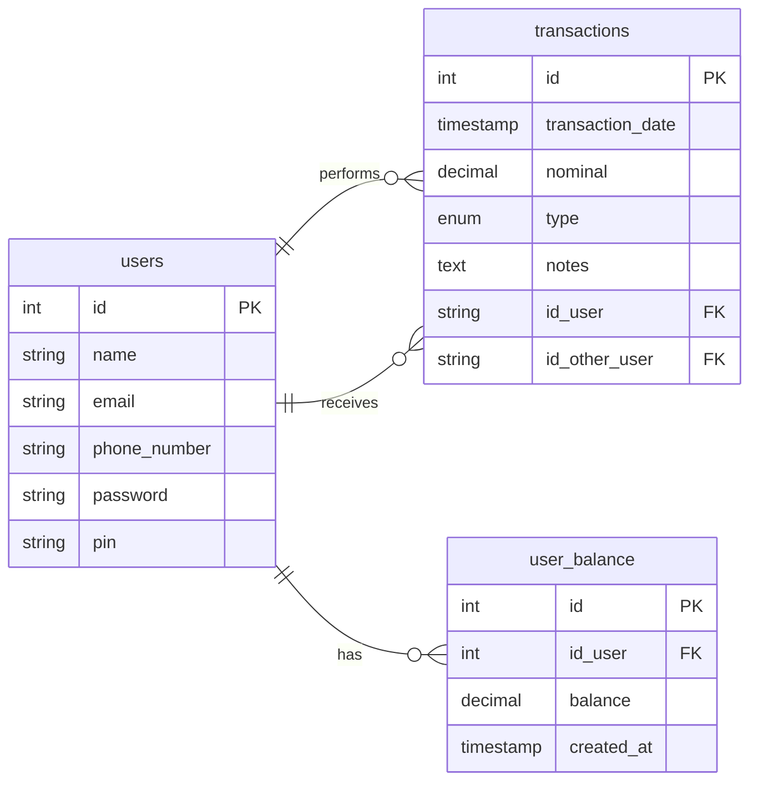

# Project Backend Go - E Wallet

This project was made by Muhammad Davinda Rinaldy in Kodacademy Training Program. This project uses Go Language to make a backend application for e-wallet and PostgreSQL for the database.

Endpoint included in this project:
1. Auth Flow (Register User & Login User)
2. Users (Update Profile, Get User By Email, Get All User & Search User by Phone Number and Name)
3. Transaction (Transfer, Top Up, History Transaction, Balance, Income & Expense)
4. Logout User

This project also protect endpoint for users and transaction with token (generated when user login) and utilizing middleware to verify the token.

## Prerequisites

Make sure you already install Go to run this project

## How to Run this Project

1. Create a new empty directory for the project and navigate into it
2. Clone this project into the empty current directory:
```
git clone https://github.com/mdavindarinaldy/fgo24-be-weeklytask.git .
``` 
3. Install dependencies
```
go mod tidy
```
4. Run the project
```
go run main.go
```
## Database Schema

### Tables
- **users**: Stores user information (id, name, email, phone number, password, and pin)
- **user_balance**: Tracks user account balances with references to the users table.
- **transactions**: Records financial transactions, including top-ups and transfers, with references to sender and receiver users.
- **blacklist_tokens**: Stores blacklisted JWT tokens to invalidate the token after user logout, ensuring they cannot be used even if they have not yet expired. This table doesn't have any relation with other tables.

### Entity Relationship Diagram (ERD)



## Dependencies
This project use:
1. gin-gonic from github.com/gin-gonic/gin : for handling HTTP request/response data (gin.Context), for defining middleware and route handlers (gin.HandlerFunc), for organizing routes into groups (gin.RouterGroup) and for managing HTTP routing and server configuration (gin.Engine)
2. jwt v5 from github.com/golang-jwt/jwt/v5 : for creating, parsing and validating JSON Web Tokens (JWT) for authentication and authorization
3. pgx from github.com/jackc/pgx/v5 : for direct database interactions (PostgreSQL)
4. godotenv from github.com/joho/godotenv : for loading environment variables from a .env file into the application

## Overview
| Method    | Group | Endpoint | Purpose | Header |
| -------- | ------- | ------- | ------- | ------ |
| POST  | /auth    | /register | Create new user | Token not needed |
| POST | /auth     | /login    | Create token for the user | Token not needed |
| PUT    | /users  | /update-profile | To edit user's profile | Token needed |
| GET | /users | ?search=&page= | Search users | Token needed |
| GET | /users | /:id | Get detail user | Token needed | 
| GET | /users | /balance | Get user's balance | Token needed | 
| GET | /users | /income | Get user's total income | Token needed | 
| GET | /users | /expense | Get user's total expense | Token needed | 
| POST | /users | /logout | To invalidate token (inserting it to blacklist token) | Token needed | 
| POST | /transactions | /top-up | Top up balance | Token needed | 
| POST | /transactions | /transfer | To transfer money to other user | Token needed | 
| GET | /transactions | /history | Get all history transactions | Token needed | 
| GET | /transactions | /history-expense | Get only 'expense' history transactions | Token needed | 
| GET | /transactions | /history-income | Get only 'income' history transactions | Token needed | 


## Basic Information
This project is part of training in Kodacademy Bootcamp Batch 2 made by Muhammad Davinda Rinaldy